# LLM 参数扩增技术深度调研报告

> **摘要**：本文系统梳理了从已训练 LLM（以 Qwen3 为例）出发、将参数量扩增约一倍的代表性技术路线，包括 Dense 模型扩增、MoE Upcycling 以及 MoE 基座模型扩增三类场景。核心结论是：若追求**零精度损失且训练数据有限**，首选 **LLaMA-Pro** 恒等块插入；若希望**精确控制参数量并控制推理延迟**，首选 **MSG** 多维度生长；若**接受架构变化且关注推理效率**，首选 **MoE Upcycling**；若基座已是 **MoE**，首选 **专家数扩展（M1）** 以在推理成本近似不变的前提下翻倍参数；若有**更大 Teacher 模型可用**，可考虑扩展+蒸馏。

## 目录

1. [问题定义与核心挑战](#一问题定义与核心挑战)
2. [路线一：架构不变的扩增方法](#二路线一架构不变的扩增方法)
3. [路线二：改变架构的扩增方法](#三路线二改变架构的扩增方法)
4. [MoE 基座模型的参数扩展](#四moe-基座模型的参数扩展)
5. [关键技术问题深度分析](#五关键技术问题深度分析)
6. [全方法横向对比](#六全方法横向对比)
7. [针对 Qwen3 的推荐方案](#七针对-qwen3-的推荐方案)
8. [关键风险与注意事项](#八关键风险与注意事项)
9. [与项目代码的衔接](#九与项目代码的衔接)
10. [参考文献](#十参考文献)

## 一、问题定义与核心挑战

**目标**：将已训练好的 LLM（如 Qwen3）参数量扩增约一倍，以最小代价保持或恢复原模型精度。

**核心矛盾**：
1. **精度保持 vs 结构变化**：任何参数维度的扩展都会改变前向传播行为，导致初始精度下降
2. **训练成本 vs 恢复质量**：精度恢复需要 continued pretraining，训练成本与恢复质量存在 trade-off

**两大技术路线**：

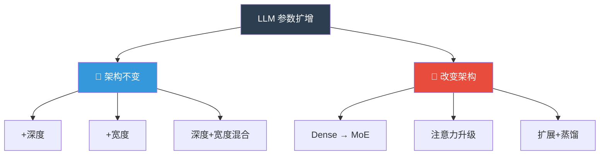

**关键评估维度**：
- 扩展后即时精度损失（zero-shot degradation）
- 恢复到原始精度所需的训练 tokens 数
- 是否支持冻结原始参数（降低训练显存与遗忘风险）
- 推理效率变化（延迟、KV Cache 显存）
- 工程实现复杂度

---

## 二、路线一：架构不变的扩增方法

> 保持 Transformer Decoder 结构不变（层结构、注意力类型、FFN 类型均不改变），仅增加层数或各维度的宽度。

---

### 方法 1：SOLAR DUS（Depth Up-Scaling）— 层重叠复制

**来源**：[Upstage](https://www.upstage.ai), [arXiv:2312.15166](https://arxiv.org/abs/2312.15166) (2023)
**代表成果**：Llama2-7B → SOLAR-10.7B (48层)，Phi-3-medium → Solar Pro-22B

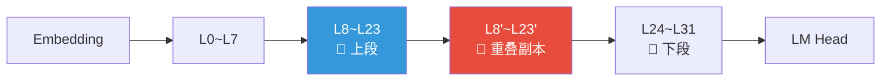

**原理**：SOLAR DUS 对原模型进行两次不同的裁剪——从第一份副本保留前 N 层（上段），从第二份副本保留后 N 层（下段），然后按"上段 → 下段"顺序拼接成更深的网络。由于两段之间存在若干重叠层（即在两份副本中都被保留的中间层），拼接点处的隐藏状态分布尽可能一致，从而减少层数骤增带来的表示断裂。该方法实现简单，但并非 function-preserving，因此需要大量 continued pretraining 来恢复精度。

- **重叠策略**：通常选择模型中间若干层作为重叠区；上段保留到重叠区末尾，下段从重叠区开头开始，两段顺序拼接后重叠层各出现一次，整体层数增加。
- **拼接点**：上段末层的输出直接作为下段首层的输入，重叠区的权重相似性使分布跳变最小化。
- **训练需求**：由于新层直接复制原层且未做恒等初始化，初始精度下降明显，需要 100B+ tokens 重新训练。

**量化评估**：
- 即时精度：显著下降（非 function-preserving），约保持 50-80%
- 恢复训练量：100B+ tokens
- 计算效率：相比从头训练节省 60-70%
- SOLAR-10.7B H6评测得分 74.20，超越 Mixtral-8x7B-Instruct（46.7B 参数）

---

### 方法 2：LLaMA-Pro 恒等块插入（Block Expansion）

**来源**：Tencent ARC & HKU, [arXiv:2401.02415](https://arxiv.org/abs/2401.02415) (2024)
**代表成果**：LLaMA2-7B → LLaMA-Pro-8.3B (40层)，Mistral-7B → Mistral-Pro

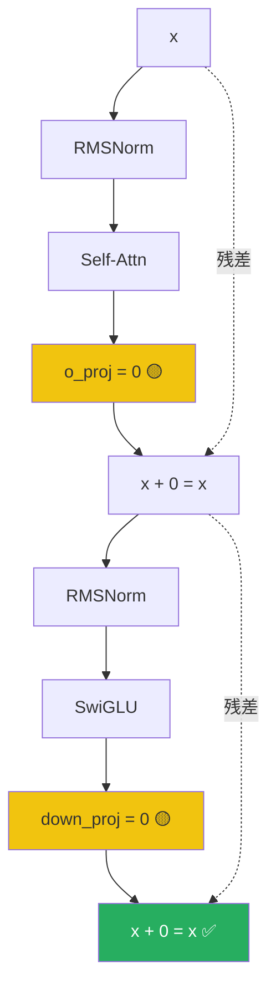

**核心初始化代码**：
```python
new_block = copy.deepcopy(original_block)
new_block.self_attn.o_proj.weight.data.zero_()   # Attention 输出 → 零
new_block.mlp.down_proj.weight.data.zero_()       # MLP 输出 → 零
```

**原理**：Transformer block 的输出通过残差连接计算 `output = input + Block(input)`。LLaMA-Pro 复制一个原始 block，然后将其 Attention 输出投影 `o_proj` 和 MLP 输出投影 `down_proj` 的权重全部置零。这样新 block 对任意输入都输出零向量，从而 `output = input`，实现严格的恒等映射。扩展后模型在初始时刻与原始模型函数完全一致，因此 zero-shot 精度**零损失**。

**训练策略（两阶段）**：

| 阶段 | 训练参数 | 数据量 | 学习率 | GPU 时间 |
|------|---------|--------|--------|---------|
| Phase 1：新块训练 | 仅新增块（冻结原始块） | ~8B tokens | 2e-4 | 2830 GPU-hours (16×H800, ~7天) |
| Phase 2：SFT | 全部参数 | ~80M tokens | 2e-5 | 较短 |

**消融实验关键发现**：
- **插入位置**：均匀插入效果最好；集中在前端或后端效果差
- **插入数量**：LLaMA2-7B（32层）插入 8 个新块（总 40 层）是最佳性价比
- **冻结策略**：冻结原始块仅训练新块，在通用能力保持上明显更好

**量化评估**：
- 即时精度：**零损失**（function-preserving）
- 恢复训练量：8-16B tokens
- 通用能力保持：< 1% 下降；领域能力：代码 +5-8%，数学 +3-5%

---

### 方法 3：LESA（Learnable Layer Scaling-Up）— SVD 插值预测

**来源**：上海交通大学, [arXiv:2502.13794](https://arxiv.org/abs/2502.13794) (2025)

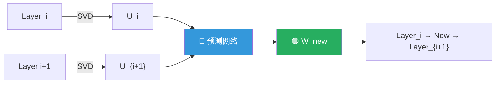

**原理**：LESA 假设相邻两层之间的参数存在可学习的低秩过渡关系。具体做法是对原模型相邻层的权重矩阵进行 SVD 分解，提取主要特征向量；然后训练一个轻量预测网络，根据相邻层的特征表示插值生成新层的参数。这样插入的新层不是简单复制，而是“预测”出来的，具有更接近真实中间层的表达能力，因此初始精度高于 DUS，收敛速度也更快。

- **SVD 分解**：揭示层间权重的低秩结构，识别哪些方向上的变化是主要信息变换。
- **预测网络**：输入相邻层的特征，输出新层权重；网络参数量远小于原模型，训练成本低。
- **插值位置**：可在任意两层之间插入多个新层，实现连续深度扩展。

**核心创新**：通过 SVD 发现层间参数的低秩模式，用小型网络预测新层参数。新层从初始化开始就具有"有意义"的参数，不需要从零学起。

**对比优势**：

| 初始化方式 | 方法 | 即时精度 | 收敛速度 |
|-----------|------|---------|---------|
| 直接复制邻近层 | DUS | 50-80% | 慢 |
| 零初始化输出投影 | LLaMA-Pro | **100%** | 中 |
| SVD 插值预测 | LESA | 80-90% | **最快** |

**量化评估**：
- 论文报告：以不到 DUS **50%** 的计算量达到相同或更好的性能
- 在 1.3B→2.6B 和 7B→14B 规模扩展实验中均有效
- 额外开销：预测网络训练约占总训练量 5%

---

### 方法 4：MSG（Masked Structural Growth）— 多维度生长

**来源**：智源研究院 BAAI, [arXiv:2305.02869](https://arxiv.org/abs/2305.02869) (2023)
**代表成果**：FLM-101B, Tele-FLM-1T

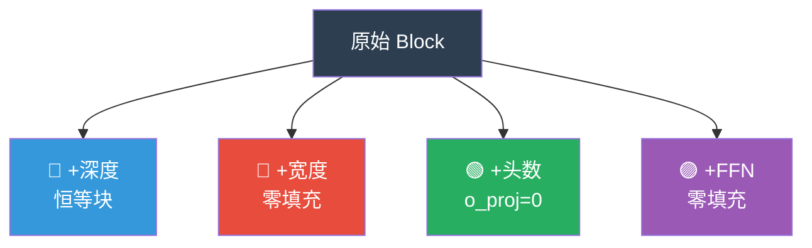

**原理**：MSG 将“扩增”视为一个渐进的掩码学习过程。对每一个待扩展维度（深度、宽度、头数、FFN），新增参数初始时被一个二进制掩码屏蔽，仅保留与原模型完全等价的功能子网络；训练过程中按预定 schedule 逐步解锁新参数，使模型先在原始能力空间内稳定，再迁移到更大的参数空间。

- **宽度生长**：对 `hidden_size`、`intermediate_size` 等维度进行零填充扩展，并用掩码控制哪些新神经元参与前向传播；初始掩码只激活原维度，function-preserving 成立。
- **深度生长**：与 LLaMA-Pro 类似，新层通过 `o_proj=0`、`down_proj=0` 初始化为恒等块。
- **生长调度**：论文提出 growth scheduler，按 token 数或 loss plateau 逐步扩大掩码比例，避免一次性解锁大量随机参数导致的训练震荡。

**量化评估**：
- 即时精度：**100%保持**（function-preserving）
- FLM-101B：3.6 倍加速，训练成本仅需非生长方案 28%
- Tele-FLM-1T：训练成本仅为非生长方案 **9.1%**，零调整零重试
- 支持四维度任意组合，灵活性最高

---

### 方法 5：Net2Net（经典理论基础）

**来源**：Google Brain, [Net2Net: Accelerating Learning via Knowledge Transfer](https://arxiv.org/abs/1511.05641), ICLR 2016

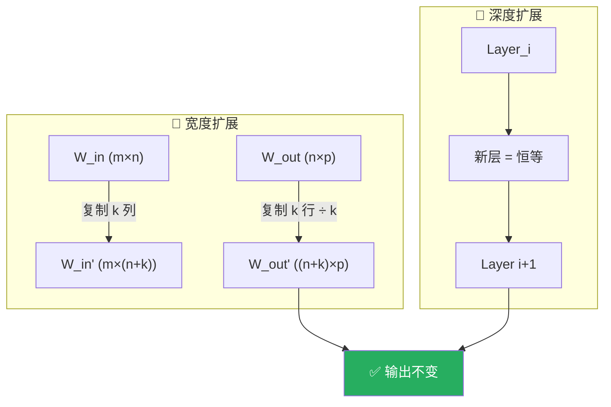

**原理**：Net2Net 提出两种函数保持（function-preserving）的模型变换：

- **Net2WiderNet**：将某层神经元复制 k 份，输入权重 `W_in` 复制 k 列，输出权重 `W_out` 复制 k 行并除以 k，保证 `W_out' · W_in' = W_out · W_in`，从而前向输出不变。
- **Net2DeeperNet**：在相邻层之间插入一个初始化为恒等变换的新层，即 `f(x) = x`，因此整体函数不变。

这两种变换是后续 LLaMA-Pro、MSG 等工作的理论基础，但原论文主要针对 CNN+ReLU，直接迁移到 Transformer 的 SwiGLU/GQA/归一化结构需要额外适配。

**在 LLM 时代的局限**：
- 原论文针对 CNN + ReLU，直接套用到 SwiGLU/GQA 需适配
- 宽度扩展后复制神经元在训练中容易陷入相同梯度（对称性问题）
- 理论意义大于实践价值，但为 MSG 和 LLaMA-Pro 奠定了理论基础

---

## 三、路线二：改变架构的扩增方法

> 在参数扩增的同时引入新的架构组件（如 Router、新注意力类型、新模块），换取更好的参数效率或推理效率。

---

### 方法 6：MoE Upcycling（Dense → 稀疏混合专家）

**来源**：[Sparse Upcycling: Training Mixture-of-Experts from Dense Checkpoints](https://arxiv.org/abs/2212.05055) (Komatsuzaki et al., ICLR 2023); 工业实践包括 [Skywork-MoE](https://huggingface.co/Skywork/Skywork-MoE)、Amazon 2025 专家复用报告等
**代表成果**：Skywork-MoE (13B→146B 总参数)

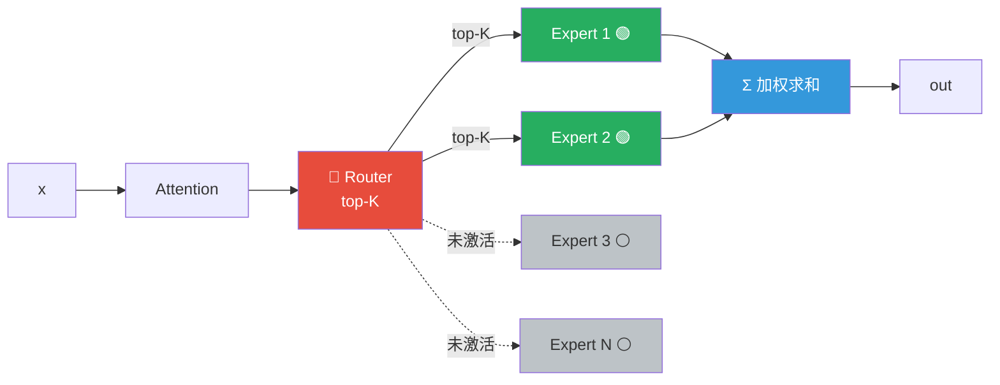

**原理**：MoE Upcycling（又称 Sparse Upcycling）的核心思想是：把 Dense 模型中已经训练好的 FFN 权重复制多份，作为多个“专家”的初始参数；同时为每层新增一个可学习的 Router，根据输入 token 的 hidden state 选择 Top-K 个专家参与计算。由于每个专家本质上仍是原 FFN 的副本，模型在扩展瞬间已经具备较强的基础能力；Router 虽然随机初始化，但专家权重提供了良好的优化起点，因此只需相对少量的 continued pretraining 即可恢复甚至超越原模型精度。

- **参数效率**：总参数量随专家数线性增长，但每个 token 只激活 K 个专家，因此推理激活参数量可保持与 Dense 模型相近（top-1 时几乎不变）。
- **负载均衡**：训练时需要加入 load balancing loss（如 switch loss / z-loss），防止 Router 把所有 token 都路由到少数“受欢迎”的专家，导致专家利用率低下和并行效率下降。
- **初始化细节**：原 FFN 的 `gate_proj`、`up_proj`、`down_proj` 被复制为每个专家的初始权重；Router 的权重通常随机初始化，或在复制后对所有专家对应的 logits 做轻微扰动以打破对称性。

**架构变化**：
- ✅ 新增 Router 网络（随机初始化）
- ✅ FFN 层结构变为 MoE 层
- ❌ Attention 层不变

**关键特性**：
- 总参数量可成倍增长，但**推理激活参数量可保持近似不变**（仅 top-1 专家参与计算时）
- 若采用 top-2，激活参数量约为原 FFN 的 2 倍，需权衡表达能力与推理成本
- Amazon 2025 研究：在多个激活比例下实现超 92% 的质量追回（具体比例取决于任务）
- 需要 MoE 推理框架支持（vLLM MoE, DeepSpeed-MoE, Megatron-LM 等）
- 训练需要 load balancing loss 防止专家负载不均，并需关注 all-to-all 通信开销

---

### 方法 7：注意力机制升级（GQA → MLA / MHA → GQA）

**来源**：[DeepSeek-V2 MLA](https://arxiv.org/abs/2405.04434) (DeepSeek-AI, 2024); Llama 2/3 GQA (Touvron et al., 2023; [Dubey et al., 2024](https://arxiv.org/abs/2407.21783))

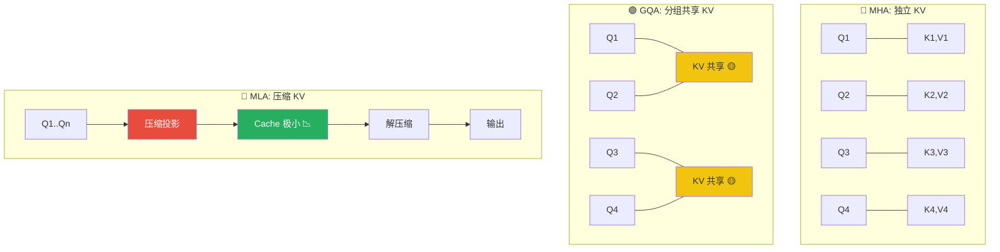

**原理**：注意力机制的升级并不直接以“翻倍参数”为目标，而是通过改变 Key/Value 的表示与缓存方式来优化推理效率或调整模型容量。

- **MHA → GQA**：将多个 query head 共享同一组 K/V 投影，减少 KV Cache 大小和内存带宽压力，但保持 attention 计算逻辑不变；参数量略有减少。
- **GQA → MLA**：进一步将 K/V 压缩到一个低维潜在向量（latent vector），解码时只缓存压缩向量，显著降低长序列下的显存占用；需要新增压缩/解压缩矩阵。
- **GQA → MHA**：反向操作，将共享的 K/V 头重新独立化，会增加参数量与 KV Cache，但可能提升表达能力；通常不推荐用于效率优先的场景。

这些转换一般作为扩参方案（如 MSG 宽度扩展）的配套调整，而非独立的翻倍参数方案。

**架构变化方式**：

| 升级路径 | 参数变化 | KV Cache | 推理效率 | 改造难度 |
|---------|---------|----------|---------|---------|
| MHA → GQA | 减少（KV头合并） | 大幅减少 | 提升 | 中 |
| GQA → MLA | 微调（新增压缩/解压矩阵） | **极大减少** | 大幅提升 | 高 |
| GQA → MHA | 增加（KV头独立） | 增加 | 不变/略降 | 低 |

**注意**：MHA/GQA/MLA 转换通常不以“翻倍参数”为目标，而是在扩参或优化时同步调整注意力机制。若目标仅为增加参数量，GQA→MHA 是简单途径，但会牺牲推理效率。

---

### 方法 8：扩展 + 知识蒸馏 流水线

**来源**：社区实践 [Qwen3-72B-Embiggened](https://huggingface.co/cognitivecomputations/Qwen3-72B-Embiggened) (cognitivecomputations, 2025)

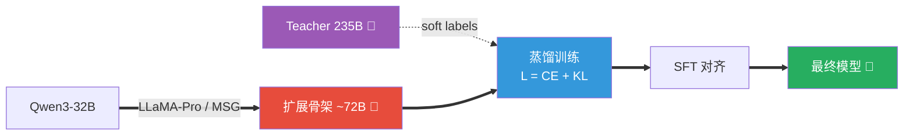

**原理**：该流水线将“参数扩增”与“知识迁移”解耦。第一步用 function-preserving 的方法（LLaMA-Pro 或 MSG）把小模型扩展为更大的骨架，保证初始精度不崩盘；第二步让一个大 Teacher 模型对相同输入生成 soft labels（logits 分布），用蒸馏损失

```
L = λ * CE(y_true, y_student) + (1-λ) * T² * KL(softmax(z_teacher/T), softmax(z_student/T))
```

指导学生模型的输出分布。由于 Teacher 已经掌握了更丰富的模式，蒸馏信号比纯自监督预训练更稠密，因此可以用更少的数据和计算达到相近的精度。

- **T（温度）**：通常取 1.5–2.5，温度越高越关注概率分布的整体形状，越低越关注硬标签。
- **λ**：CE 与 KL 的权重，常见设置为 0.5 或根据任务调整。
- **数据效率**：社区实践表明，蒸馏可把 continued pretraining 所需数据量减少 30-50%，但代价是需要大量 Teacher 推理。

**核心思路**：先用 LLaMA-Pro/MSG 扩展参数骨架，再用 Teacher 的 soft labels 蒸馏，最后用少量 SFT 对齐。

**优势**：
- Teacher 信号比自监督更高效，数据需求更少
- 可跳过大量 continued pretraining
- 社区已有实践：Qwen3-72B-Embiggened（32B→72B骨架，计划从235B蒸馏）

**代价**：需要大模型推理资源产生 soft labels

---

## 四、MoE 基座模型的参数扩展

> 当基座模型本身就是 MoE 架构（如 Qwen3-235B-A22B、DeepSeek-V3、Mixtral 等），参数扩展有独特的技术路线。MoE 的核心特性——稀疏激活——使得"增加总参数而不增加推理计算量"成为可能。

---

### MoE 扩展维度总览

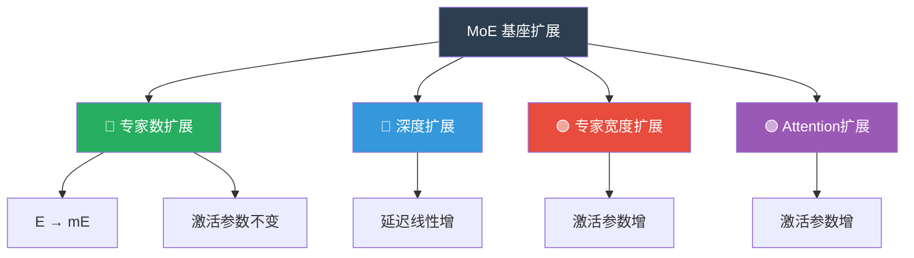

---

### 方案 M1：Expert Upcycling — 专家数量扩展（首选）

**来源**：[Expert Upcycling: Shifting the Compute-Efficient Frontier of Mixture-of-Experts](https://arxiv.org/abs/2604.19835), arXiv:2604.19835 (Amazon, 2026)

> ⚠️ 该引用为 2026 年预印本，非常新，正式使用前请核对原文中的具体数字与实验设置。

**原理**：Expert Upcycling 把 MoE 基座模型中已有的 E 个专家各自复制一份（或按效用选择部分专家复制），得到 mE 个专家。由于每个 token 仍只激活原来的 Top-K 个专家，推理时的计算量几乎不变；但总参数量随专家数线性增长。复制后必须破坏对称性，否则 Router 会给副本分配相同分数，副本无法分化出不同专长。

- **效用导向选择**：不盲目复制所有专家，而是根据专家在训练数据上的梯度重要性或激活频率，优先复制“高价值”专家，实验表明这比均匀复制的 **gap 闭合速度提升 3 倍以上**。
- **Router 扩展**：原 Router 输出维度为 E，扩展后输出维度为 mE。新增列从被复制专家的对应列初始化，并加入小噪声，既保留原路由偏好，又允许新专家获得独立分数。
- **对称性破坏**：见下方三种策略；这是决定扩展效果的关键步骤。

**核心思路**：将已有 E 个专家的 MoE 扩展为 mE 个专家，保持 Top-K 路由不变，推理激活参数不变。

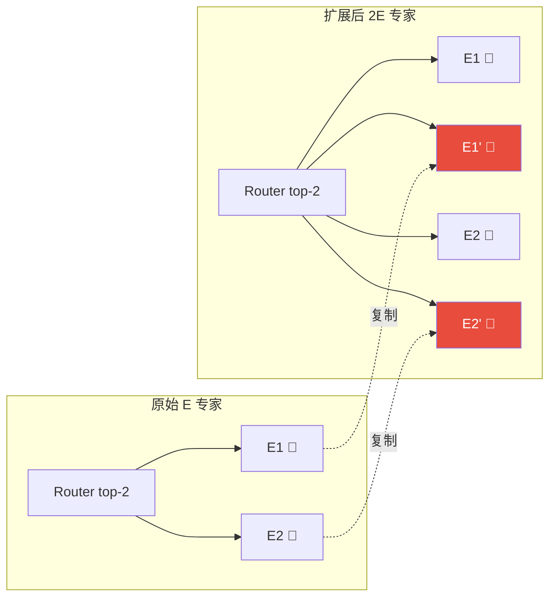

**三种专家选择策略**：

| 策略 | 做法 | 效果 |
|------|------|------|
| 均匀复制 | 每个专家等概率复制一份 | 基线，简单 |
| 效用导向（推荐） | 基于梯度重要性分数，优先复制高价值专家 | 差距闭合提升 **3 倍以上** |
| 随机子集 | 随机选部分专家复制 | 效果不稳定 |

**对称性破坏**（关键步骤）：

复制后所有副本参数完全相同，Router 会给它们相同的分数，导致无法专业化。必须打破对称性：

> 以下代码为示意伪代码，实际实现需对 `gate_proj`、`up_proj`、`down_proj` 等所有专家参数分别处理。

```python
# 方法1: 加噪（经典但效果有限）
for param in new_expert.parameters():
    param += torch.randn_like(param) * noise_std  # noise_std ≈ 0.01

# 方法2: Drop-Upcycling — 随机重置部分参数（更激进）
for param in new_expert.parameters():
    mask = torch.rand_like(param) > drop_ratio  # drop_ratio ≈ 0.1
    param *= mask

# 方法3: Cluster-Aware Upcycling（2026最新，效果最好）
# 论文: arXiv:2604.13508 — 先按训练数据对 token 做聚类，再让不同副本专家在不同 cluster 上微调
# ⚠️ 该引用为 2026 年预印本，使用前请核对原文。
```

**Router 扩展**：

```python
# 原始 Router: W_router ∈ R^{d_model × E}
# 扩展为:     W_router' ∈ R^{d_model × mE}
# 新增列从被复制专家的对应列初始化（+ 小噪声）
W_router_new[:, new_idx] = W_router[:, src_idx] + noise
```

**量化评估**（Amazon 论文）：
- 7B→13B 总参数（专家数翻倍），性能对齐从头训练基线
- 节省 **32% GPU 时长**；若复用已有 checkpoint 可省 **67%**
- 推理激活参数：**不变**（Top-K 不变）
- 推理延迟：**近似不变**（仅 Router 计算量微增）

---

### 方案 M2：MoE 层深度扩展

**思路**：与 Dense 模型的深度扩展完全类似——在已有 MoE 层之间插入新的 MoE 层（含 Attention + MoE-FFN），使用恒等块初始化。

**原理**：在相邻 MoE 层之间插入新层，新层中 Attention 的 `o_proj` 和每个专家的 `down_proj` 初始化为零，因此新层整体满足 `Layer(x) ≈ x`，模型函数保持不变。由于新层包含完整 Router + 专家组结构，插入后总专家数随层数增加，但每层仍只激活 K 个专家，因此推理延迟与 Dense 深度扩展一样线性增加，而总参数增长更快。

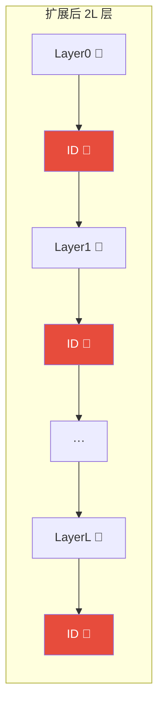

**关键要点**：
- 新插入的 MoE 层中，**所有专家的 down_proj 初始化为零** → 恒等映射
- Attention 部分的 o_proj 同样初始化为零
- 专家数量与原始层保持一致
- 推理延迟线性增加（与 Dense 深度扩展一致）

---

### 方案 M3：专家内部宽度扩展

**思路**：扩展每个专家的 `intermediate_size`（FFN 隐藏维度），或扩展共享的 `d_model`。

**原理**：对每个专家内部的 FFN 做宽度扩展，等价于对 Dense FFN 做 MSG 风格的零填充生长。新增的中间维度初始为零，`down_proj` 对新增维度对应的行也初始化为零，因此专家函数保持不变；扩展后每个被激活专家承担的计算量增加，整体表达能力增强。若扩展共享的 `d_model`，则需同步调整所有投影矩阵（Attention、FFN、Embedding、LM Head）的输入/输出维度，并在新增维度上做零填充，保证 function-preserving。

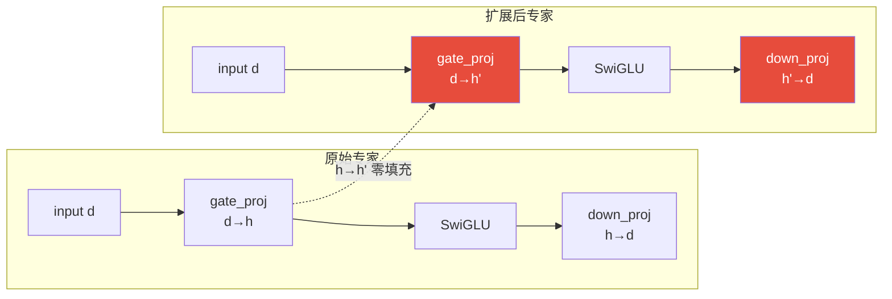

**注意**：
- 扩展 `intermediate_size` 不影响专家间的 Router（Router 只看 `d_model`）
- 会增加每个被激活专家的推理计算量
- 使用 MSG 风格的零填充保证 function-preserving

---

### 方案 M4：Attention 层扩展（d_model / num_heads）

**原理**：MoE 架构中 Attention 层通常是 Dense 的（所有 token 共享），扩展方式与 Dense 模型一致。增加 `num_attention_heads` 时，对新增 head 的 `o_proj` 输出权重初始化为零，保证新增 head 不影响残差输出；增加 `d_model` 时，对所有线性层的输入/输出维度同步零填充，使新增维度在前向传播中贡献为零。这样可在保持 function-preserving 的前提下扩大注意力容量。

**实现要点**：
- 增加 `num_attention_heads` / `num_kv_heads`：新增头的 o_proj 初始化为零
- 增加 `d_model`：所有层的投影矩阵同步零填充扩展

---

### MoE 扩展方案对比

| 方案 | 参数增长 | 推理激活参数 | 推理延迟 | Function Preserving | 训练成本 |
|------|---------|------------|---------|:---:|---------|
| M1: 专家数扩展 | 线性 ×m | **不变** | **近似不变** | 需对称性破坏 | 节省 32-67% |
| M2: 深度扩展 | 线性 ×层数 | 线性增 | 线性增 | ✓ (恒等初始化) | 低 |
| M3: 专家宽度扩展 | ~平方增 | 增加 | 增加 | ✓ (零填充) | 中 |
| M4: Attention扩展 | ~平方增 | 增加 | 增加 | ✓ (零填充) | 中 |
| M1+M2 组合 | 灵活 | 可控 | 可控 | 部分 | 最优 |

### MoE 基座扩展推荐决策

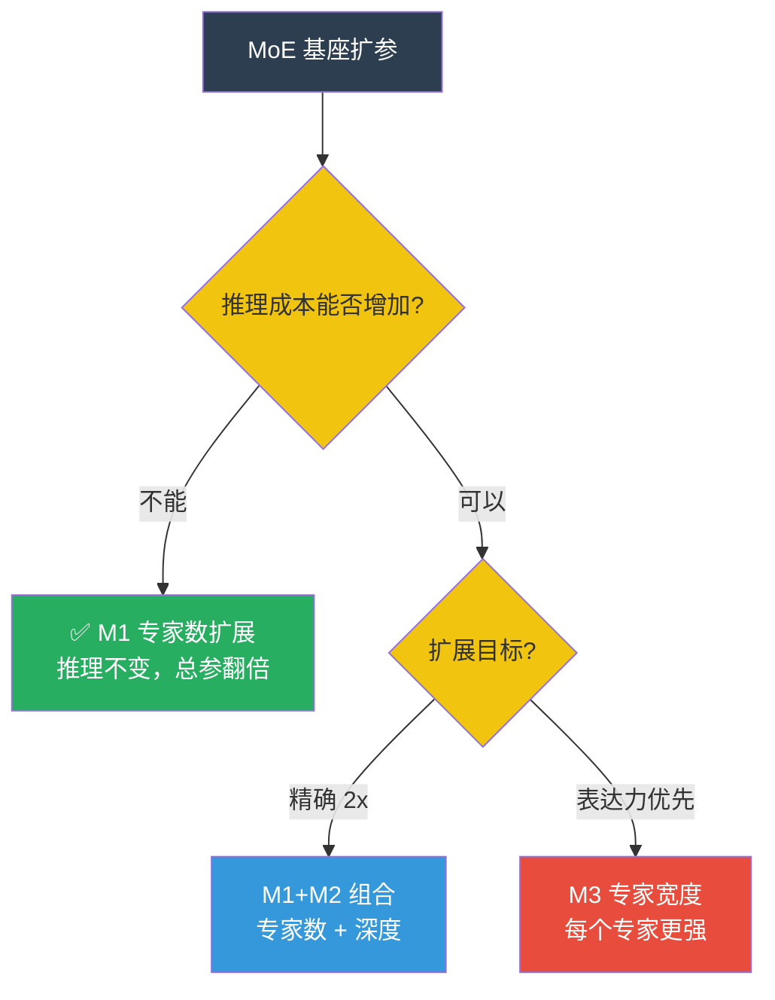

**核心结论**：MoE 基座模型的参数扩展**首选 M1（专家数扩展）**——这是 MoE 架构独有的优势，能在推理成本几乎不变的前提下实现参数翻倍。配合效用导向的专家选择和 Cluster-Aware 对称性破坏，可以最大化扩展收益。

---

## 五、关键技术问题深度分析

### 5.1 初始化策略对比

| 策略 | 方法 | 即时精度 | 训练收敛 | 实现难度 |
|------|------|---------|---------|---------|
| 零初始化输出投影 | LLaMA-Pro | **100%保持** | 中速 | 低 |
| 邻近层直接复制 | SOLAR DUS | 50-70%保持 | 中速 | 极低 |
| 重叠复制（上下拼接） | SOLAR DUS | 60-80%保持 | 中速 | 极低 |
| SVD 插值预测 | LESA | 80-90%保持 | **快速** | 中 |
| 掩码零填充 | MSG | **100%保持** | 中速 | 中 |
| 结构感知插值 | Embiggened | 40-60%保持 | 需蒸馏 | 高 |

### 5.2 层间冗余与有效深度

[arXiv:2512.14064](https://arxiv.org/abs/2512.14064) 揭示：**许多 LLM 的深层存在显著冗余**。该引用为 2025 年底预印本，使用前建议核对原文。

- 层间表示余弦相似度在中间层往往 >0.95
- 权重矩阵存在 "Patch-Like" 相关性分布（参见层剪枝/冗余分析相关研究，如 [Layer Pruning](https://arxiv.org/abs/2403.19135)）
- 移除 20-35% 中间层后，zero-shot 精度下降不超过 2%

**对扩增的启示**：
1. 不是所有层都值得复制 — 优先复制信息变换最丰富的层
2. 简单加深不一定有效 — 冗余层的复制只增加更多冗余
3. 修剪研究可反向指导扩展 — 被修剪影响最大的层最值得复制

### 5.3 Continued Pretraining 最佳实践

**学习率策略**（以 8B-14B 模型为例，需根据实际损失曲线微调）：

| 新增语料量 | 推荐初始 LR | Warmup 步数 | 衰减方式 |
|-----------|------------|------------|---------|
| < 0.5B tokens | 5e-6 | 500 | cosine |
| 0.5-5B tokens | 1e-5 | 2000 | linear → cosine |
| 5-50B tokens | 2e-5 | 5000 | cosine |
| > 50B tokens | 5e-5 ~ 1e-4 | 5000-10000 | cosine with re-warmup |

**数据混合**：
- 使用与原始预训练分布高度一致的数据，避免分布漂移
- 混入 5-10% 高质量指令数据作为"锚定"，保留指令跟随能力
- 数据过滤建议：剔除 PPL 异常高、n-gram 重复率 > 0.15 的低质样本（具体阈值需根据模型校准）

**冻结策略**：
```
Phase 1（30-50% 训练量）: 冻结原始层，仅训练新增参数
  → 保护原始能力，快速适应新参数
Phase 2（50-70% 训练量）: 解冻全部，LR 降为 Phase 1 的 1/5~1/10
  → 整体微调，弥合新旧参数分布差异
```

**监控指标**：
- 训练 loss 是否持续下降并趋于稳定
- 扩展后模型与原模型在标准 benchmark 上的差距变化
- 领域任务上的正向迁移与通用任务上的遗忘程度

---

## 六、全方法横向对比

### 6.1 架构不变 vs 架构改变对比

| 方法 | 路线 | Function Preserving | 扩展方向 | 即时精度 | 恢复数据量 | 推理效率影响 | 工业验证 |
|------|:---:|:---:|:---:|:---:|:---:|:---:|:---:|
| SOLAR DUS | 架构不变 | ✗ | 深度 | 50-80% | 100B+ tokens | 延迟 ↑↑ | ★★★ |
| LLaMA-Pro | 架构不变 | ✓ | 深度 | **100%** | 8-16B tokens | 延迟 ↑↑ | ★★★ |
| LESA | 架构不变 | 近似 | 深度 | 80-90% | <50B tokens | 延迟 ↑↑ | ★★☆ |
| MSG | 架构不变 | ✓ | 深度+宽度 | **100%** | 30-60B tokens | 可控 | ★★★ |
| Net2Net | 架构不变 | ✓ | 深度+宽度 | **100%** | 中等 | 可控 | ★☆☆ |
| MoE Upcycling | **架构改变** | ✗ | 稀疏 | 70-85% | 中高 | **近似不变 (top-1)** | ★★★ |
| 注意力升级 | **架构改变** | ✗ | 注意力 | 需训练 | 高 | **改善** | ★★☆ |
| 扩展+蒸馏 | 混合 | 取决于Step1 | 任意 | 取决于Step1 | 中低 | 取决于架构 | ★★☆ |

*注：MoE 的“近似不变”指 top-1 路由下的激活参数量；top-2 会引入额外计算。*

### 6.2 成本效益分析（以 8B → 16B 为例估算）

| 方案 | 路线 | CPT 数据量 | GPU-Hours (H800) | 精度恢复 | 推理延迟 |
|------|------|-----------|-----------------|---------|---------|
| 从头训练 16B | — | 完整预训练 | ~100,000+ | 基准 | 基准 |
| LLaMA-Pro | 不变 | 8-16B tokens | **~3,000-6,000** | 98-100% | 2x |
| LESA | 不变 | 30-50B tokens | ~8,000-15,000 | 95-100% | 2x |
| MSG 混合 | 不变 | 30-60B tokens | ~5,000-10,000 | 98-100% | 1.4-1.6x |
| SOLAR DUS | 不变 | 100-200B tokens | ~15,000-30,000 | 95-100% | 1.5-2x |
| MoE Upcycling (top-1) | 改变 | 50-100B tokens | ~10,000-20,000 | 92-98% | **~1x** |
| 扩展+蒸馏 | 混合 | 20-50B tokens | ~8,000-15,000 | 95-100% | 取决于架构 |

---

## 七、针对 Qwen3 的推荐方案

### Qwen3 架构特征

| 模型 | 层数 | hidden_size | num_heads | num_kv_heads | intermediate_size | 参数量 |
|------|------|------------|-----------|-------------|-------------------|--------|
| Qwen3-8B | 36 | 4096 | 32 | 8 | 12288 | ~8.2B |
| Qwen3-14B | 40 | 5120 | 40 | 8 | 17408 | ~14.8B |
| Qwen3-32B | 64 | 5120 | 64 | 8 | 25600 | ~32.8B |

> **注意**：Qwen3 Dense 系列包括 0.6B、1.7B、4B、8B、14B、32B 六个规格；MoE 系列包括 30B-A3B 和 235B-A22B。上表仅列出适合参数扩增讨论的中大规模 Dense 模型。Qwen3 不存在官方 7B 或 72B Dense 模型（请勿与 Qwen2.5 系列混淆）。所有 Qwen3 Dense 模型均采用 GQA（KV 头数统一为 8）。以上数据基于官方技术报告和 config.json，如有更新请以 [Qwen3 官方仓库](https://huggingface.co/Qwen) 为准。

**对扩增的启示**：
- Qwen3 系列采用 **GQA（统一 8 KV heads）+ SwiGLU FFN**，与 LLaMA-Pro/MSG 的假设一致，可直接套用恒等块/掩码生长
- 8B→14B 的扩增可通过深度（36→40 层）+ 宽度（4096→5120）组合实现，但"翻倍参数"不等于简单复制官方更大规格的配置
- 14B 与 32B 的 hidden_size 相同（5120），主要差异在层数（40 vs 64）和 intermediate_size（17408 vs 25600），提示：深度扩展是大模型扩参的高效路径

### 综合决策流程

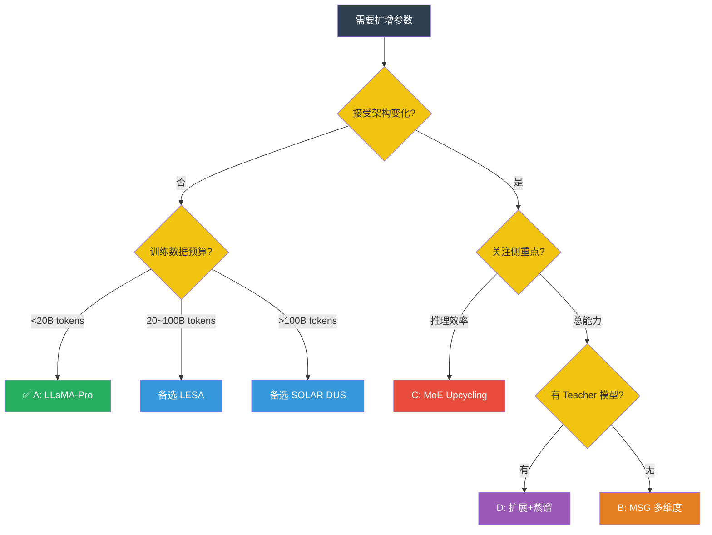

### 方案 A（首选 / 架构不变）：LLaMA-Pro 恒等块插入

**适用场景**：精度保持最优先，训练预算有限，可接受推理延迟上升

```
原始模型:  Qwen3-8B, 36 层, hidden_size=4096, 约 8.2B 参数
扩展策略（论文风格 / 保守）:
  每 4 个原始块后插入 1 个恒等块 → 36 + 9 = 45 层, ~10.2B 参数

扩展策略（激进 / 接近 2x）:
  每 1 个原始块后插入 1 个恒等块 → 36 + 36 = 72 层, ~16B 参数
  注意：深度翻倍会显著增加推理延迟与 KV Cache，需评估线上成本

恒等块初始化:
  - 从上一层深拷贝 Q/K/V/gate_proj/up_proj 参数
  - o_proj.weight → zero_(),  down_proj.weight → zero_()

训练:
  Phase 1 — 冻结原始块，仅训练新块 (8-16B tokens, lr=2e-4)
  Phase 2 — 全量微调 (4-8B tokens, lr=1e-5)
  总计: ~3000-5000 GPU-hours (16×H800)
```

**优势**：即时精度 100%（恒等初始化），训练量最少，工程实现简单
**风险**：纯深度翻倍会导致推理延迟翻倍、KV Cache 翻倍；保守方案参数量不足 2x

---

### 方案 B（架构不变 / 灵活）：MSG 多维度混合生长

**适用场景**：精确控制参数量，有强工程团队

```
原始模型: Qwen3-8B (36层, d=4096)
生长策略: 组合扩展（需配合 MSG 掩码逐步解锁新维度）
  - 深度: 36 → 46 层 (Transformer block 参数增 ~28%)
  - 宽度: 4096 → 4608 (Attention/Embedding 相关参数增 ~27%)
  - FFN: 12288 → 15360 (MLP 参数增 ~25%)
  总参数增: ~1.28 × 1.27 × 1.25 ≈ 2x（实际略低于 2x，因 Embedding/LM Head 不变）

优势: 推理延迟仅增 ~40%（优于纯深度翻倍），且生长过程 function-preserving
```

---

### 方案 C（架构改变 / 推理高效）：MoE Upcycling

**适用场景**：推理效率不能降低，接受架构变化，有 MoE 训练/推理基础设施

```
原始模型: Qwen3-8B (约 8.2B 参数，FFN 约占 5.4B)
每层 FFN 复制 8 份 → 8 Expert, top-1 路由
  总参数: ~8.2B - 5.4B + 8 × 5.4B ≈ 46B
  激活参数: 与原始 Dense 模型近似持平（Attention + 1 Expert）

若使用 top-2 路由：
  激活参数约为原模型的 1.8-2.0 倍，推理延迟仍低于同总参数量 Dense 模型

训练: 全量 CPT 50-100B tokens（需 load balancing loss + z-loss）
需要: MoE 推理框架 (vLLM, DeepSpeed-MoE, Megatron-LM)
```

---

### 方案 D（混合路线 / 效果上限最高）：扩展 + 蒸馏

**适用场景**：有大 teacher 模型可用

```
Step 1: LLaMA-Pro 扩展 Qwen3-8B → ~16B 骨架
Step 2: 用 Qwen3-32B 或 235B-A22B 为 teacher 蒸馏
        Loss = 0.5 * CE + 0.5 * KL(T=2.0)
Step 3: 少量 SFT 对齐

优势: teacher 信号 >> 自监督，数据效率最高
```

---

### 决策速查表

| 约束条件 | 推荐方案 | 核心理由 |
|----------|---------|---------|
| 精度最重要，数据有限 | **A: LLaMA-Pro** | 零精度损失，8-16B tokens |
| 推理延迟不能翻倍 | **B: MSG 混合** 或 **C: MoE** | MSG 延迟增 ~40%；MoE (top-1) 近似不变 |
| 追求极致简单 | SOLAR DUS | 10 行代码，但需 100B+ tokens |
| 有大 teacher 模型 | **D: 扩展+蒸馏** | 效果上限最高 |
| 需精确 2x 参数 | B: MSG | 多维度任意组合 |

---

## 八、关键风险与注意事项

**推理效率影响**：
- 纯深度翻倍 → 延迟 ↑2x，KV Cache ↑2x
- MSG 混合扩展 → 延迟 ↑1.4x（更优）
- MoE (top-1) → 激活延迟近似不变，但显存占用增加（需存全部专家权重）

**灾难性遗忘防范**：
- 冻结原始层是最有效策略
- 混入 5-10% 原始预训练分布的 replay 数据
- 监控与原模型输出的 KL 散度

**评估检查点**：
- 扩展后立即评估（验证 function-preserving 或量化初始损失）
- 每 5B tokens 评估 MMLU / C-Eval / GSM8K / HumanEval / ARC
- 画出"精度恢复曲线"确认收敛趋势

**工程实施 Checklist**：
- [ ] 确认原始模型权重可加载，记录各层参数分布
- [ ] 根据目标参数量选择扩增方案并计算预期参数规模
- [ ] 实现初始化逻辑后，用随机输入验证扩展前后输出一致性（function-preserving 方法应完全一致）
- [ ] 准备 continued pretraining 数据，混合原始分布数据与目标领域数据
- [ ] 配置冻结策略、学习率调度、load balancing loss（MoE）
- [ ] 建立评估流水线，每固定步数保存 checkpoint
- [ ] 训练完成后进行 SFT / DPO 对齐，恢复指令跟随能力

---

## 九、与项目代码的衔接

本仓库已提供部分参数扩增工具，可将调研结论快速落地：

| 研究方向 | 已实现的脚本 | 能力说明 |
|---------|------------|---------|
| 深度扩展（DUS / 简单复制） | `utils/expand_model_layers.py` | 按指定规则复制已有层，支持 sequential / 固定源层 / 自定义映射 |
| MoE 专家扩展（Dense→MoE / MoE 基座扩展 M1） | `utils/expand_moe_experts.py` | 将 Dense FFN 或已有 MoE 的专家数按倍数扩展，支持加噪打破对称性 |
| Grouped Expert Routing 扩展 | `scripts/expand_model_experts_group.sh` | 针对 grouped expert routing 结构的专家扩展与配置生成 |
| 权重一致性校验 | `utils/verify_expanded_weights.py` | 校验扩展后模型是否保留原始层/原始专家权重 |

**落地建议**：
1. 若选择 **LLaMA-Pro / MoE 深度扩展（M2）**：当前 `expand_model_layers.py` 仅做简单复制，需在复制后将新块/新层的 `o_proj` / `down_proj` 置零，才能实现恒等映射
2. 若选择 **MSG / M3 专家宽度扩展**：仓库尚未实现宽度/FFN 的掩码生长，需要新增按维度零填充与渐进解锁逻辑
3. 若选择 **MoE Upcycling / M1 专家数扩展**：可直接使用 `expand_moe_experts.py` 将 FFN 或已有专家复制为多份，并通过 `--noise-scale` 等参数打破对称性，再补充 Router 训练与 load balancing loss
4. 无论哪种方案，扩展后先用 `verify_expanded_weights.py` 验证原始参数未被意外修改

---

## 十、参考文献

1. **SOLAR DUS**: Kim et al., "SOLAR 10.7B: Scaling Large Language Models with Simple yet Effective Depth Up-Scaling", [arXiv:2312.15166](https://arxiv.org/abs/2312.15166) (2023)
2. **Solar Pro**: Upstage, "Solar Pro Preview: Phi-3-medium → 22B via Enhanced DUS" (2024) — 官方技术报告，见 [Upstage Hugging Face](https://huggingface.co/upstage)
3. **LLaMA-Pro**: Wu et al., "LLaMA Pro: Progressive LLaMA with Block Expansion", [arXiv:2401.02415](https://arxiv.org/abs/2401.02415) (2024)
4. **LESA**: Yang et al., "LESA: Learnable LLM Layer Scaling-Up", [arXiv:2502.13794](https://arxiv.org/abs/2502.13794) (2025)
5. **Net2Net**: Chen, Goodfellow & Shlens, "Net2Net: Accelerating Learning via Knowledge Transfer", [arXiv:1511.05641](https://arxiv.org/abs/1511.05641), ICLR 2016
6. **MSG**: Du et al., "Masked Structural Growth for 2x Faster Pre-training", [arXiv:2305.02869](https://arxiv.org/abs/2305.02869) (2023)
7. **FLM-101B**: Li et al., "FLM-101B: An Open LLM and How to Train It with $100K Budget", [arXiv:2309.03852](https://arxiv.org/abs/2309.03852) (2023)
8. **Tele-FLM-1T**: TeleAI & BAAI, "Tele-FLM: An Open Billion-Parameter Language Model" (2024) — 见 [arXiv:2401.16600](https://arxiv.org/abs/2401.16600) 或官方仓库
9. **Sparse Upcycling**: Komatsuzaki et al., "Sparse Upcycling: Training Mixture-of-Experts from Dense Checkpoints", [arXiv:2212.05055](https://arxiv.org/abs/2212.05055), ICLR 2023
10. **Skywork-MoE**: Kunlun, "Skywork-MoE: A Production-Scale MoE Model via Upcycling" (2024) — [Hugging Face 模型页](https://huggingface.co/Skywork/Skywork-MoE)
11. **Amazon Expert Reuse**: Amazon AI, "Expert Reuse for Mixture-of-Experts Scaling" (2025) — 企业技术报告
12. **Effective Depth**: "What Affects the Effective Depth of LLMs?", [arXiv:2512.14064](https://arxiv.org/abs/2512.14064) (2025)
13. **层冗余分析**: 参见 [Streamlining Redundant Layers](https://arxiv.org/abs/2403.19135) 及 [What Affects the Effective Depth of LLMs?](https://arxiv.org/abs/2512.14064) 等关于层冗余与有效深度的研究
14. **Deep Progressive Training**: Bu et al., "Scaling Up Depth Capacity of Large Language Models" (OpenReview 2025)
15. **Qwen3-Embiggened**: cognitivecomputations, "Qwen3-72B-Embiggened" (2025) — [Hugging Face](https://huggingface.co/cognitivecomputations/Qwen3-72B-Embiggened)
16. **Layer Pruning**: Chen et al., "Streamlining Redundant Layers of Large Language Models", [arXiv:2403.19135](https://arxiv.org/abs/2403.19135) (2024)
17. **DeepSeek-V2 MLA**: DeepSeek AI, "DeepSeek-V2: A Strong, Economical and Efficient Mixture-of-Experts Language Model", [arXiv:2405.04434](https://arxiv.org/abs/2405.04434) (2024)
18. **CPT Best Practices**: "Simple and Scalable Strategies for Continual Pre-training of Large Language Models" (2024) — 可检索标题获取原文或社区整理版本
19. **Expert Upcycling**: Amazon AI, "Expert Upcycling: Shifting the Compute-Efficient Frontier of Mixture-of-Experts", [arXiv:2604.19835](https://arxiv.org/abs/2604.19835) (2026) ⚠️ 非常新，请核对原文
20. **Cluster-Aware Upcycling**: "Enhancing Mixture-of-Experts Specialization via Cluster-Aware Upcycling", [arXiv:2604.13508](https://arxiv.org/abs/2604.13508) (2026) ⚠️ 非常新，请核对原文
21. **Soft MoE**: Google DeepMind, "From Sparse to Soft Mixture of Experts" (2024) — [arXiv:2308.00951](https://arxiv.org/abs/2308.00951)
22. **MoE Redundancy**: "Exploiting Mixture-of-Experts Redundancy Unlocks Multimodal Generative Abilities", [arXiv:2503.22517](https://arxiv.org/abs/2503.22517) (2025)
23. **DeepSeek-V3**: DeepSeek AI, "DeepSeek-V3 Technical Report" (2024) — [arXiv:2412.19437](https://arxiv.org/abs/2412.19437)

*注：部分条目为社区/企业技术报告，未正式发表于顶会；2026 年的几篇引用非常新，引用前请尽量查找原文或官方发布页面以核实具体数字与方法细节。*
