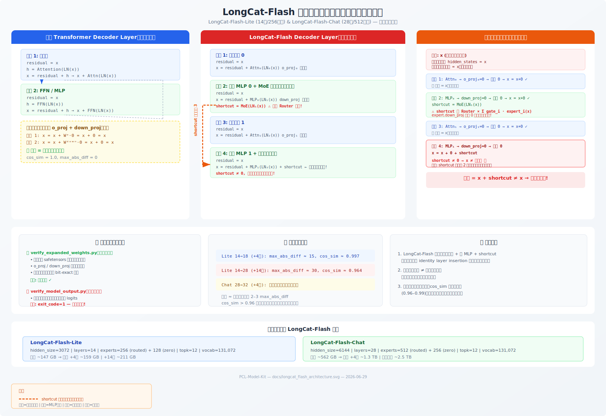

# LongCat-Flash-Chat MoE 扩展指南

## 一、模型概览

| 参数 | 值 |
|------|------|
| `architectures` | `LongcatFlashForCausalLM` |
| `hidden_size` | 6144 |
| `expert_ffn_hidden_size` | 2048 |
| `num_layers` | 28 |
| `n_routed_experts` | 512 |
| `zero_expert_num` | 256 (identity 类型，无存储权重) |
| `moe_topk` | 12 |
| `num_attention_heads` | 64 |
| `kv_lora_rank` / `q_lora_rank` | 512 / 1536 |

> LongCat-Flash-Chat 的 256 个 zero expert 为 identity 类型，不在 safetensors 中存储权重参数。扩展时仅复制 routed expert 权重，zero expert 仅在 config 和 Router 维度中按比例同步扩展。

---

## 二、三种扩展方式

### 2.1 方案 M1：专家数扩展（Expert Upcycling）

#### 概述

将 512 个 routed expert 翻倍至 1024，推理激活参数不变（仍 top-12），总参数约 2×。

```bash
bash scripts/expand_longcat_chat_experts.sh
```

#### 三类张量的具体处理

**Expert 权重 (routed expert 0-511)**

映射关系由 `build_expert_target_map(512, 1024)` 构建：

```
new_idx = 512, 513, ..., 1023
src_idx = new_idx % 512 = 0, 1, ..., 511
```

每个专家的 `gate_proj.weight`、`up_proj.weight`、`down_proj.weight` 全部 `tensor.clone()`。原始 expert 0-511 保持不动，新增 expert 512-1023 是精确副本。

**Router 权重 (`mlp.router.classifier.weight`)**

```
原始 Router: [768, 6144]
             ├── real_part: tensor[:512]   (512 个 routed expert 的路由行)
             └── zero_part: tensor[512:]   (256 个 zero expert 的路由行)

扩展后:
  expanded_real = cat([real_part, real_part], dim=0)   → [1024, 6144]
  expanded_zero = cat([zero_part, zero_part], dim=0)   → [512, 6144]
  output = cat([expanded_real, expanded_zero], dim=0)  → [1536, 6144]
```

Router Bias (`e_score_correction_bias`) 同理: `[768] → [1536]`。

**非专家参数 (attention, norm, embed, lm_head)**

直接原样拷贝，不做任何修改。

#### Config 变更

| 字段 | 原始 | 扩展后 |
|---|---|---|
| `n_routed_experts` | 512 | 1024 |
| `zero_expert_num` | 256 | 512 |
| `moe_topk` | 12 | 12 (不变) |
| `num_layers` | 28 | 28 (不变) |

#### 输出概要

```
原始: 43,756 个参数,  75 shards, 561.9 GB
扩展: 86,764 个参数, 148 shards, 2206.9 GB
新增: 43,008 个张量 (512 experts × 28 layers × 3 params)
      + 28 router weight 扩展 + 28 router bias 扩展
```

#### 关键特性

- **推理成本不变**: `moe_topk` 保持 12，每个 token 仍只激活 12 个专家
- **Function-preserving**: 副本与原始完全相同，Router 给同源副本相同分数，扩展后模型输出与原始模型数学等价
- **对称性未打破**: 默认不加噪声。如需后续训练分化，使用 `--router-noise-scale 1e-6 --expert-noise-scale 0.01`

---

### 2.2 方案 M2：深度扩展（Identity Layer Insertion）

#### 概述

在 28 层中均匀插入 4 个恒等初始化层，总层数 32。恒等层分布在网络的 1/4、1/2、3/4、尾部位置。

```bash
bash scripts/expand_longcat_chat_depth.sh
```

#### 恒等映射原理

新层通过将 `o_proj.weight` 和 `down_proj.weight` 置零实现恒等映射：

```
output = input + Attention(Norm(input)) + MLP(Norm(...))
       = input + 0 + 0   (因为 W_o = 0, W_down = 0)
       = input            ← 恒等映射
```

#### Interleave 模式布局

**默认 +4 层扩展 (28→32, `copy_source=7,14,21,27`)**：恒等层均匀分布

```
[L0] ... [L7] [ID←7] [L8] ... [L14] [ID←14] [L15] ... [L21] [ID←21] [L22] ... [L27] [ID←27]
```

| 扩展后索引 | 来源 | 类型 |
|:-:|:-:|:-:|
| 0-7 | orig 0-7 | 原始 |
| 8 | orig 7 | 恒等 (identity-initialized) |
| 9-15 | orig 8-14 | 原始 |
| 16 | orig 14 | 恒等 (identity-initialized) |
| 17-23 | orig 15-21 | 原始 |
| 24 | orig 21 | 恒等 (identity-initialized) |
| 25-30 | orig 22-27 | 原始 |
| 31 | orig 27 | 恒等 (identity-initialized) |

恒等层均匀分布在网络的 1/4、1/2、3/4、尾部位置，对后续训练通常比集中在前部更有利。

```bash
# 在层 7, 14, 21, 27 后面各插入一个恒等层
python -m utils.expand_moe_depth \
    --model_dir /path/to/LongCat-Flash-Chat \
    --output_dir /path/to/output \
    --target_layers 32 \
    --copy_source "7,14,21,27" \
    --insertion_mode interleave
```

**2× 扩展 (28→56)**：每个原始层后插入一个恒等层

```bash
TARGET_LAYERS=56 COPY_SOURCE="" bash scripts/expand_longcat_chat_depth.sh
```

```
[L0] [ID←0] [L1] [ID←1] [L2] [ID←2] ... [L27] [ID←27]
```

#### Append 模式布局

原始 28 层顺序不变，恒等层追加在末尾：

```bash
INSERTION_MODE=append bash scripts/expand_longcat_chat_depth.sh
```

```
[L0] [L1] ... [L27] [ID←7] [ID←14] [ID←21] [ID←27]
```

每个新层的处理：
- `self_attn.{0,1}.o_proj.weight` → 置零
- `mlp.experts.{0..511}.down_proj.weight` → 置零
- `mlps.{0,1}.down_proj.weight` → 置零
- 其余权重 → 从源层精确复制

#### Config 变更

| 字段 | 原始 | 扩展后 |
|---|---|---|
| `num_layers` | 28 | 32 |
| 其余字段 | 不变 | 不变 |

#### 输出概要

```
扩展: 50,004 个参数, 86 shards, 1283.8 GB
新增恒等层: 4 层, 2,064 个张量置零
```

---

### 2.3 方案 M1+M2：联合扩展（Combined）

#### 概述

单次完成深度 + 专家扩展。默认 28→32 层（+4 层）+ 512→1024 专家。

```bash
bash scripts/expand_longcat_chat_combined.sh
```

#### 层映射

与 M2 的 28→32 interleave 完全一致，`copy_source=7,14,21,27`：

```
[L0] ... [L7] [ID←7] [L8] ... [L14] [ID←14] [L15] ... [L21] [ID←21] [L22] ... [L27] [ID←27]
```

| 扩展后索引 | 来源 | 类型 |
|:-:|:-:|:-:|
| 0-7 | orig 0-7 | KEPT (原始) |
| 8 | orig 7 | NEW (恒等) |
| 9-15 | orig 8-14 | KEPT (原始) |
| 16 | orig 14 | NEW (恒等) |
| 17-23 | orig 15-21 | KEPT (原始) |
| 24 | orig 21 | NEW (恒等) |
| 25-30 | orig 22-27 | KEPT (原始) |
| 31 | orig 27 | NEW (恒等) |

如需前置集中恒等层，可使用 `COPY_SOURCE="" bash scripts/expand_longcat_chat_combined.sh`（默认 seq 模式）。

#### 专家映射

每个原始 expert 复制出 1 个副本：`expert 0 → [0, 512]`，`expert 1 → [1, 513]`，...，`expert 511 → [511, 1023]`。共 512 对。

#### KEPT 层的张量结构（如扩展后 layer 0 ← orig 0）

| 组件 | 原始 shape | 扩展后 shape | 处理方式 |
|------|-----------|-------------|---------|
| `router.classifier.weight` | [768, 6144] | [1536, 6144] | 扩展 (见 Router 布局) |
| `router.e_score_correction_bias` | [768] | [1536] | 同上 |
| `experts.0-511.{gate,up,down}_proj` | 不变 | 不变 | 保留原值 |
| `experts.512-1023.{gate,up,down}_proj` | 新增 | 同原始 | clone(expert[i%512]) |
| `self_attn`, `layernorm`, `mlps` | 不变 | 不变 | 不变 |

#### NEW 恒等层的张量结构（如扩展后 layer 1 ← orig 0）

| 组件 | 处理方式 |
|------|---------|
| `router.classifier.weight` | 从 orig 0 的 router 扩展为 [1536, 6144] |
| `experts.0-1023.gate_proj.weight` | clone(orig 0 的 expert[i%512]) |
| `experts.0-1023.up_proj.weight` | clone(orig 0 的 expert[i%512]) |
| `experts.0-1023.down_proj.weight` | **全零** (identity init) |
| `self_attn.{0,1}.o_proj.weight` | **全零** (identity init) |
| `self_attn 其余 (q/kv proj 等)` | clone(orig 0) |
| `mlps.{0,1}.down_proj.weight` | **全零** (identity init) |
| `mlps.{0,1}.gate/up_proj` | clone(orig 0) |
| `input_layernorm`, `post_attention_layernorm` | clone(orig 0) |

#### Router 权重内部布局

```
原始 [768, 6144]:
  行 0-511:    real part (512 个 routed expert 路由权重)
  行 512-767:  zero part (256 个 zero expert 路由权重)

扩展后 [1536, 6144]:
  行 0-511:      real_block_0 (orig real part)
  行 512-1023:   real_block_1 (real part 的副本)
  行 1024-1279:  zero_block_0 (orig zero part)
  行 1280-1535:  zero_block_1 (zero part 的副本)
```

Bias 同理：`[768] → [1536]`，布局 `[real×2 | zero×2]`。

#### Config 变更

| 字段 | 原始 | 扩展后 |
|---|---|---|
| `num_layers` | 28 | 32 |
| `n_routed_experts` | 512 | 1024 |
| `zero_expert_num` | 256 | 512 |
| `moe_topk` | 12 | 12 (不变) |

#### 输出概要

```
扩展: 99,156 个参数, 169 shards, 2521.3 GB
新增恒等层: 4 层, 置零参数: 4,112 个
```

---

## 三、验证方法

所有扩展输出均通过 `verify_expanded_weights.py` 验证，支持 `layers`、`experts`、`combined` 三种模式。

### 专家扩展验证

```bash
bash scripts/verify_expanded_weights.sh experts \
    /path/to/LongCat-Flash-Chat \
    /path/to/LongCat-Flash-Chat-expertx2
```

验证内容：Router shape `[1536, 6144]`、expert 0-1023 索引完整、expert 512 == expert 0 (bit-exact)、非专家参数不变。

### 深度扩展验证

```bash
bash scripts/verify_expanded_weights.sh layers \
    /path/to/LongCat-Flash-Chat \
    /path/to/LongCat-Flash-Chat-depth32 \
    --orig_layers 28 --target_layers 32 --copy_source "7,14,21,27" --insertion_mode interleave
```

验证内容：32 层结构完整、新层（8/16/24/31）`o_proj`/`down_proj` 全零、kept 层与原始层 bit-exact 匹配（含 interleave 重映射）。

### 联合扩展验证

```bash
bash scripts/verify_expanded_weights.sh combined \
    /path/to/LongCat-Flash-Chat \
    /path/to/LongCat-Flash-Chat-combined \
    --orig_layers 28 --target_layers 32 \
    --copy_source "7,14,21,27" --insertion_mode interleave
```

验证内容：同时检查层映射 + 专家复制 + 恒等初始化。

> **注意**: 如果使用了非默认的 `COPY_SOURCE`（如 `"6,13,20,26"`），验证时必须传入相同的 `--copy_source` 值，否则层映射将不匹配。

### 模型输出功能验证

`verify_model_output.py` 提供端到端的功能验证。Chat 模型较大（原始 562 GB），需要使用 `--sequential` 模式并确保 CPU 内存充足（>1 TB）。

```bash
python3 utils/verify_model_output.py \
    --orig_dir /path/to/LongCat-Flash-Chat \
    --exp_dir /path/to/LongCat-Flash-Chat-depth32 \
    --device npu --dtype float32 --atol 1e-5 \
    --mode all --sequential \
    --json_output /tmp/verification_results.json
```

> **注意**: NPU 仅 61 GB 内存，无法容纳 Chat 模型（562 GB float32）。如有大容量 CPU 内存环境（>1.5 TB）可尝试 CPU 推理验证。

| 验证方式 | 速度 | 覆盖范围 |
|---------|------|---------|
| `verify_expanded_weights.py` | 快（直接读取 safetensors） | 权重结构正确性 |
| `verify_model_output.py` | 慢（加载完整模型推理） | 端到端功能正确性 |

两者互补：权重验证通过但推理失败说明模型架构代码存在兼容性问题。

---

## 四、输出权重路径

| 扩展方式 | 输出路径 | 大小 |
|---------|---------|------|
| M1 专家扩展 | `/home/jianzhnie/llmtuner/hfhub/cache/LongCat-Flash-Chat-expertx2` | 2206.9 GB |
| M2 深度扩展 | `/home/jianzhnie/llmtuner/hfhub/cache/LongCat-Flash-Chat-depth32` | 1283.8 GB |
| M1+M2 联合 | `/home/jianzhnie/llmtuner/hfhub/cache/LongCat-Flash-Chat-combined` | 2521.3 GB |

---

## 五、自定义扩展

### 指定目标专家数

```bash
TARGET_EXPERTS=768 bash scripts/expand_longcat_chat_experts.sh
```

### 指定扩展倍数

```bash
EXPERT_EXPANSION_FACTOR=3 bash scripts/expand_longcat_chat_experts.sh
EXPERT_EXPANSION_FACTOR=4 bash scripts/expand_longcat_chat_combined.sh
```

### 指定目标层数

```bash
# 深度 2× (28→56, 每层后插入恒等层)
TARGET_LAYERS=56 COPY_SOURCE="" bash scripts/expand_longcat_chat_depth.sh
```

### 均匀分布恒等层（默认配置）

默认 `copy_source=7,14,21,27` 让恒等层均匀分布在网络的 1/4、1/2、3/4、尾部位置：

```bash
# 28→32, 在层 7/14/21/27 后面各插入一个恒等层 (默认)
bash scripts/expand_longcat_chat_depth.sh

# 联合扩展同理 (默认)
bash scripts/expand_longcat_chat_combined.sh
```

自定义分布位置：

```bash
# 在层 6/13/20/26 后面各插入一个恒等层
COPY_SOURCE="6,13,20,26" bash scripts/expand_longcat_chat_depth.sh
```

### 带对称性破坏噪声（推荐用于后续训练）

```bash
ROUTER_NOISE_SCALE=1e-6 EXPERT_NOISE_SCALE=0.01 \
    bash scripts/expand_longcat_chat_experts.sh
```

### 同步扩展 moe_topk

```bash
# 专家数 2× 时 topk 也 2× (12→24)
TARGET_TOPK=24 bash scripts/expand_longcat_chat_experts.sh

# 联合扩展同理
TARGET_TOPK=24 bash scripts/expand_longcat_chat_combined.sh
```

### 使用 append 模式（非交错）

```bash
INSERTION_MODE=append bash scripts/expand_longcat_chat_depth.sh
```

---

## 六、方案对比

| 方案 | 参数增长 | 推理延迟 | Function Preserving | 适用场景 |
|------|---------|---------|:---:|---------|
| M1: 专家数 2× | ~2× | 不变 | ✅ 需对称性破坏 | 推理成本受限 |
| M2: 深度 +4 | ~1.14× | ~1.14× | ⚠️ 近似保持[[1]](#fn1) | 表达力优先 |
| M1+M2 联合 | ~2.3× | ~1.14× | ⚠️ 近似保持[[1]](#fn1) | 综合扩展 |

<a id="fn1">[1]</a>: LongCat-Flash 架构的双注意力 + 双 MLP + shortcut 连接导致 identity layer insertion **非严格函数保持**。权重验证通过，但端到端输出存在偏差（Lite 实测 cos_sim ≈ 0.97）。详见 [注意事项](#八注意事项) 第 6 条。

---

## 七、脚本与工具索引

### Shell 脚本

| 脚本 | 说明 |
|------|------|
| `scripts/expand_longcat_chat_experts.sh` | M1 专家数扩展 |
| `scripts/expand_longcat_chat_depth.sh` | M2 深度扩展 |
| `scripts/expand_longcat_chat_combined.sh` | M1+M2 联合扩展 |
| `scripts/verify_expanded_weights.sh` | 验证扩展权重（支持 experts/layers/combined） |

### Python 工具

| 文件 | 说明 |
|------|------|
| `utils/expand_moe_experts.py` | M1 专家扩展核心逻辑 |
| `utils/expand_moe_depth.py` | M2 深度扩展核心逻辑 |
| `utils/expand_moe_combined.py` | M1+M2 联合扩展核心逻辑 |
| `utils/verify_expanded_weights.py` | 权重验证（layers/experts/combined 三种模式）|
| `utils/verify_model_output.py` | 功能验证（前向 logit 比较 + 生成 token 比较）|
| `utils/shared.py` | 共享工具：`build_layer_mapping`、`should_zero`、`expand_router_weight` 等 |

---

## 八、注意事项

1. **Identity zero expert**: LongCat-Flash-Chat 的 256 个 zero expert 为 identity 类型，不在 safetensors 中存储权重。扩展时仅在 config 和 Router 维度中按比例扩展 `zero_expert_num`（256→512），验证时自动跳过 zero expert 的权重索引检查。
2. **Interleave 模式**: 深度扩展默认使用 interleave 模式，新层交错插入原始层之间。验证时必须指定 `--insertion_mode interleave`，否则层映射不匹配。
3. **磁盘空间**: 扩展前确保目标目录有足够空间（联合扩展约需 2.5 TB，深度 +4 层约需 1.3 TB）。
4. **并行写入**: 默认使用 4 个 worker 并行写入，可通过 `WORKERS` 环境变量调整。推荐使用 16 个 worker 以加速大模型扩展。
5. **两遍处理**: 所有扩展脚本均使用两遍处理（Pass 1 扫描 header 计算布局，Pass 2 加载写入），确保输出 shard 文件名从一开始就是正确的。
6. **LongCat-Flash 架构的函数保持性限制 ⚠️**: LongCat-Flash-Chat 的 Decoder Layer 并非标准 Transformer 结构，其使用了 **双并行注意力头 + 双并行 MLP + 快捷连接（shortcut）** 的非标准残差路径（与 Lite 模型相同架构）。

   **标准 Transformer（理论假设）**：

   ```
   子层 1:  x = x + Attn(LN(x))
   子层 2:  x = x + FFN(LN(x))
   ```

   置零 `o_proj` + `down_proj` 后：`x = x + 0 + 0 = x` → **严格恒等**。

   **LongCat-Flash-Chat 实际结构**：

   ```
   子层 1:  x = x + Attn₀(LN₀(x))
   子层 2:  x = x + MLP₀(LN₁(x))      shortcut = MoE(LN₁(x))   ← 快捷输出暂存
   子层 3:  x = x + Attn₁(LN₂(x))
   子层 4:  x = x + MLP₁(LN₃(x)) + shortcut                    ← 快捷输出在此注入
   ```

   

   置零 `o_proj` + `down_proj` 后：

   ```
   子层 1:  x = x + 0 = x
   子层 2:  x = x + 0 = x              shortcut = MoE(LN₁(x)) ≠ 0  ← 非零!
   子层 3:  x = x + 0 = x
   子层 4:  x = x + 0 + shortcut = x + shortcut ≠ x             ← 非恒等!
   ```

   快捷连接从子层 2 提取 MoE 输出，跨越子层 3 后注入子层 4。即使将新层的所有 `o_proj` 和 `down_proj` 置零，子层 2 的 MoE 路由计算仍会产生非零的 `shortcut` 值——因为 Router 自身的分类器权重并未置零，且路由后的 expert 加权求和即使每个 expert 的 `down_proj=0` 输出为零，Router 本身的计算路径（`classifier` → `topk` → `gate` → `softmax`）并不经过被置零的参数。

   **影响**：
   - `verify_expanded_weights.py`（权重结构检查）**通过**——所有置零参数确实为零
   - `verify_model_output.py`（端到端功能检查）**不通过**——Chat 模型因体积过大（原始 562 GB，扩展后 1.3–2.5 TB）暂未运行端到端验证（NPU 仅 61 GB），但架构层面与 Lite 模型完全一致，故推断存在相同偏差
   - Lite 实测：max_abs_diff ≈ 15（+4 层）≈ 30（+14 层），误差随恒等层数量**线性累积**
   - `cos_sim` 保持在高位（0.96–0.99），输出方向高度相关，可用于训练初始化

   **适用场景**：尽管不是严格函数保持，扩展模型仍可用于后续训练——恒等层的输出与输入高度相关（cos_sim > 0.96），可作为良好的初始化起点。若需要严格函数保持的深度扩展，需针对 LongCat 架构修改恒等初始化逻辑（同时将 shortcut 路径中的 MoE Router 输出也归零，或重构残差连接）。
