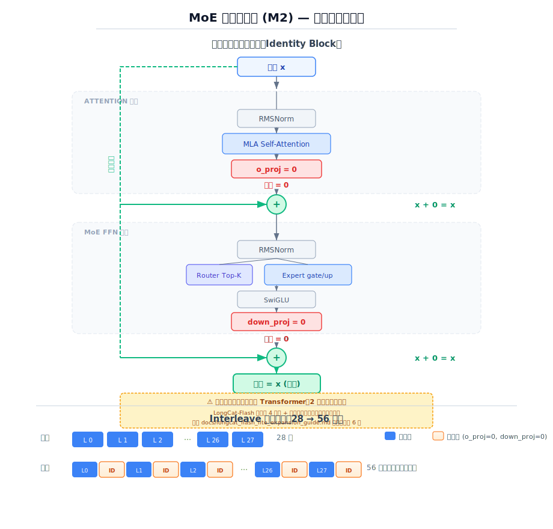

# MoE 层深度扩展 (M2) 使用指南

## 一、方案原理

### 核心思想



MoE 层深度扩展（方案 M2）通过在已有 MoE 层之间插入**恒等初始化**的新层来增加模型深度。新层在初始化时满足 `Layer(x) = x`，因此扩展后的模型与原模型在前向传播上**完全等价**（function-preserving），不会产生任何精度损失。

> **⚠️ 架构限制**: 上述恒等映射假设标准 Transformer 残差结构（`x = x + Attn(LN(x)) + FFN(LN(x))`）。对于 **LongCat-Flash 系列**模型（Lite / Chat），其 Decoder Layer 使用了双并行注意力头 + 双并行 MLP + 快捷连接（shortcut）的非标准残差路径，导致恒等层插入**不是严格函数保持的**（实测 max_abs_diff ≈ 15–30，cos_sim ≈ 0.96–0.997）。详见 [LongCat-Flash-Lite 扩展指南](longcat_flash_lite_expansion_guide.md) 和 [LongCat-Flash-Chat 扩展指南](longcat_flash_chat_expansion_guide.md) 的注意事项第 6 条。

### 恒等映射原理

Transformer 层的输出通过残差连接计算：

```
output = input + Attention(Norm(input)) + MLP(Norm(...))
```

当 Attention 的输出投影 `o_proj` 权重为零时：

```
Attention(x) = x @ W_q @ W_k^T @ W_v @ W_o = 0  (因为 W_o = 0)
```

当 MLP（专家）的 `down_proj` 权重为零时：

```
MLP(x) = SwiGLU(x @ W_gate, x @ W_up) @ W_down = 0  (因为 W_down = 0)
```

因此残差输出为：

```
output = input + 0 + 0 = input  ✓ 恒等映射
```

### 对 LongCat-Flash-Chat 的具体操作

LongCat-Flash-Chat 每层结构：

| 组件 | 参数 | 新层中的处理 |
|------|------|-------------|
| `self_attn.0.o_proj.weight` | MLA 注意力输出 | → 置零 |
| `self_attn.1.o_proj.weight` | MLA 注意力输出 | → 置零 |
| `mlp.experts.{0..511}.down_proj.weight` | 512 个专家输出 | → 置零 |
| `mlps.{0,1}.down_proj.weight` | 共享 MLP 输出 | → 置零 |
| 其余所有权重 | 输入投影、归一化等 | → 从源层复制 |

每个新层共 516 个张量置零，1,302 个张量从源层复制。

### 扩展结构示意

**Interleave 模式 — 2× 扩展**（每个原始层后插入恒等层）：

```
原始:    [Layer0] [Layer1] [Layer2] ... [Layer27]

扩展后:  [Layer0] [ID_0] [Layer1] [ID_1] [Layer2] [ID_2] ... [Layer27] [ID_27]
                   ↑ 恒等          ↑ 恒等            ↑ 恒等              ↑ 恒等
```

**Interleave 模式 — 部分扩展**（新增层数 < 原始层数时的排布）：

以 14→18（+4 层）为例，默认 `copy_source=seq` 生成 `source_list=[0,1,2,3]`。
`build_layer_mapping` 按原始层顺序遍历，仅在 source 为层 0-3 的位置各插入一个恒等层：

```
[L0] [ID←0] [L1] [ID←1] [L2] [ID←2] [L3] [ID←3] [L4] [L5] ... [L13]
      ↑恒等        ↑恒等        ↑恒等        ↑恒等   ← 后续无插入
```

恒等层集中在前部。如需均匀分布，通过 `--copy_source` 手动指定 source 层：

```bash
# 在层 3, 6, 9, 12 后面各插入恒等层
python -m utils.expand_moe_depth \
    --model_dir /path/to/model --output_dir /path/to/output \
    --target_layers 18 --copy_source "3,6,9,12" --insertion_mode interleave
```

得到：

```
[L0] [L1] [L2] [L3] [ID←3] [L4] [L5] [L6] [ID←6] [L7] [L8] [L9] [ID←9] [L10] [L11] [L12] [ID←12] [L13]
```

恒等层均匀分布在网络的 1/4、1/2、3/4、尾部位置，后续训练效果通常优于集中前部。

**Append 模式**：

```
扩展后:  [Layer0] [Layer1] ... [Layer27] [ID_0] [ID_1] ... [ID_27]
                                          ↑────── 全部恒等层 ──────↑
```

### 与其他 MoE 扩展方案的对比

| 方案 | 参数增长 | 推理延迟 | Function Preserving | 适用场景 |
|------|---------|---------|:---:|---------|
| **M1: 专家数扩展** | 线性 ×m | 近似不变 | 需对称性破坏 | 推理成本受限 |
| **M2: 深度扩展** | 线性 ×层数 | 线性增加 | ⚠️ 近似保持[[1]](#fn1) | 表达力优先、精度保持 |
| M3: 专家宽度扩展 | ~平方增 | 增加 | ✓ | 单专家能力增强 |

<a id="fn1">[1]</a>: 对于标准 Transformer（2 子层）架构为严格函数保持；对于 LongCat-Flash 系列（双注意力 + 双 MLP + shortcut），由于 shortcut 绕过置零参数，恒等初始化仅近似保持（实测 cos_sim > 0.96），详见 [LongCat 扩展指南](longcat_flash_lite_expansion_guide.md) 注意事项第 6 条。

---

## 二、使用方法

### 基本用法

```bash
python -m utils.expand_moe_depth \
    --model_dir /path/to/original_model \
    --output_dir /path/to/expanded_model
```

默认将层数翻倍，使用 interleave 模式。

### 完整参数

```bash
python -m utils.expand_moe_depth \
    --model_dir /path/to/original_model \
    --output_dir /path/to/expanded_model \
    [--original_layers N]       # 原始层数，默认从 config.json 自动检测
    [--target_layers M]         # 目标层数，默认 2×original
    [--copy_source SOURCE]      # 新层的来源映射
    [--insertion_mode MODE]     # interleave 或 append
```

### 参数说明

| 参数 | 默认值 | 说明 |
|------|--------|------|
| `--model_dir` | 必填 | 原始模型目录（含 config.json 和 safetensors 分片） |
| `--output_dir` | 必填 | 扩展模型输出目录 |
| `--original_layers` | 自动检测 | 原始层数，从 config 的 `num_layers` 读取 |
| `--target_layers` | 2×原始 | 目标总层数 |
| `--copy_source` | `seq` | 新层来源：`seq`=循环复制, `5`=全部复制第5层, `0,0,1,1,...`=逐一指定 |
| `--insertion_mode` | `interleave` | `interleave`=交错插入, `append`=追加到末尾 |
| `--workers` | `1` | 并行写入 worker 数（推荐 4–16） |

### LongCat-Flash-Chat 扩展示例

**2× 深度扩展（28→56 层）**：

```bash
python -m utils.expand_moe_depth \
    --model_dir /path/to/LongCat-Flash-Chat \
    --output_dir /path/to/LongCat-Flash-Chat-56L \
    --target_layers 56 \
    --insertion_mode interleave
```

### LongCat-Flash-Lite 扩展示例

**2× 深度扩展（14→28 层）**：

```bash
bash scripts/expand_longcat_lite_depth.sh
```

等价的 Python 命令：

```bash
python -m utils.expand_moe_depth \
    --model_dir /path/to/LongCat-Flash-Lite \
    --output_dir /path/to/LongCat-Flash-Lite-depth2 \
    --target_layers 28 \
    --insertion_mode interleave \
    --workers 4
```

LongCat-Flash-Lite 每层结构：

| 组件 | 参数 | 新层中的处理 |
|------|------|-------------|
| `self_attn.{0,1}.o_proj.weight` | MLA 注意力输出 | → 置零 |
| `mlp.experts.{0..255}.down_proj.weight` | 256 个专家输出 | → 置零 |
| `mlps.{0,1}.down_proj.weight` | 共享 MLP 输出 | → 置零 |
| 其余所有权重 | 输入投影、归一化等 | → 从源层复制 |

**保守扩展（28→42 层，均匀隔层插入）**：

```bash
python -m utils.expand_moe_depth \
    --model_dir /path/to/LongCat-Flash-Chat \
    --output_dir /path/to/LongCat-Flash-Chat-42L \
    --target_layers 42 \
    --copy_source "0,2,4,6,8,10,12,14,16,18,20,22,24,26" \
    --insertion_mode interleave
```

每隔一层插入一个恒等层（source 为偶数层），新层均匀分布在整个网络中。

**指定复制中间层（只复制 layer 10-23 的权重）**：

```bash
python -m utils.expand_moe_depth \
    --model_dir /path/to/LongCat-Flash-Chat \
    --output_dir /path/to/LongCat-Flash-Chat-42L \
    --target_layers 42 \
    --copy_source "10,11,12,13,14,15,16,17,18,19,20,21,22,23" \
    --insertion_mode interleave
```

---

## 三、验证方法

### 运行自动化测试

```bash
pytest tests/test_expand_moe_depth.py -v
```

### 使用 verify_expanded_weights.py

```bash
# LongCat-Flash-Chat 深度扩展验证 (28→56)
bash scripts/verify_expanded_weights.sh layers \
    /path/to/LongCat-Flash-Chat \
    /path/to/LongCat-Flash-Chat-56L \
    --orig_layers 28 --target_layers 56 --insertion_mode interleave

# LongCat-Flash-Lite 深度扩展验证 (14→28)
bash scripts/verify_expanded_weights.sh layers \
    /path/to/LongCat-Flash-Lite \
    /path/to/LongCat-Flash-Lite-depth2 \
    --orig_layers 14 --target_layers 28 --insertion_mode interleave
```

> 注意：验证时 `--insertion_mode` 必须与扩展时使用的模式一致，否则层映射不匹配会导致验证失败。

测试覆盖：

1. `build_layer_mapping` 单元测试（2×、3×、非均匀）
2. `should_zero` 模式匹配（8 种置零 + 9 种保留）
3. 残差恒等性数学证明
4. Interleave / Append 两种模式的完整端到端验证
5. 权重拷贝精确性（bit-exact）
6. 原始层保持不变
7. 非层参数（embed、norm、lm_head）未被修改
8. 非均匀扩展边界情况（4→6 层）

### 手动验证扩展后输出一致性

```python
import torch
from safetensors.torch import load_file

# 加载原始和扩展后的权重
orig = load_file("original_model/model_00001-of-00075.safetensors")
expanded = load_file("expanded_model/model-00001-of-00150.safetensors")

# 验证新层的 o_proj 为零
key = "model.layers.1.self_attn.0.o_proj.weight"  # 第一个新层
assert torch.all(expanded[key] == 0), "o_proj should be zero"

# 验证新层的 expert down_proj 为零
key = "model.layers.1.mlp.experts.0.down_proj.weight"
assert torch.all(expanded[key] == 0), "expert down_proj should be zero"
```

---

## 四、后续训练建议

扩展后的模型是 function-preserving 的，后续训练分两阶段：

### Phase 1：新层训练

- **训练参数**：仅新增的恒等层（冻结原始层）
- **数据量**：8-16B tokens
- **学习率**：2e-4
- **目的**：让新层从恒等映射出发，学习有意义的变换

### Phase 2：全量微调

- **训练参数**：全部参数
- **数据量**：4-8B tokens
- **学习率**：1e-5（Phase 1 的 1/10~1/20）
- **目的**：弥合新旧层之间的分布差异

### 注意事项

- 使用与原始预训练分布一致的数据，避免灾难性遗忘
- 混入 5-10% 高质量指令数据作为锚定
- 监控 loss 曲线和标准 benchmark（MMLU、GSM8K 等）
- 深度翻倍会使推理延迟翻倍，需评估线上成本

---

## 五、技术细节

### 文件结构

```
utils/
├── expand_moe_depth.py        # M2 深度扩展主脚本
├── tests/test_expand_moe_depth.py   # 综合验证测试
├── expand_moe_experts.py      # M1 专家数扩展（参考实现）
├── expand_model_layers.py     # 简单层复制（无恒等初始化）
├── verify_expanded_weights.py # 权重一致性校验
└── shared.py                  # 共享工具函数
```

### 置零的参数模式

```python
ZERO_PATTERNS = [
    r"self_attn\.(?:\d+\.)?o_proj\.weight$",   # MLA/MHA 注意力输出
    r"mlp\.experts\.\d+\.down_proj\.weight$",   # MoE 专家输出
    r"mlps\.\d+\.down_proj\.weight$",           # 共享 MLP 输出
    r"mlp\.down_proj\.weight$",                 # Dense MLP 输出
]
```

这些模式覆盖了 LongCat-Flash-Chat（MLA + MoE）、标准 Transformer（MHA + Dense FFN）以及混合架构。

### 输出文件格式

扩展脚本输出与 HuggingFace 标准兼容的模型目录：

- `config.json`：更新 `num_layers` 为目标层数
- `model.safetensors.index.json`：新的权重映射
- `model-XXXXX-of-YYYYY.safetensors`：分片权重文件
- 其余辅助文件（tokenizer 等）原样复制

### 与 M1 专家扩展的组合

M1 和 M2 可以组合使用，支持两种方式：

**方式一：联合扩展（推荐，单次 IO）**

```bash
# LongCat-Flash-Lite: 14→18 层 + 256→512 专家
bash scripts/expand_longcat_lite_combined.sh

# 验证
bash scripts/verify_expanded_weights.sh combined \
    /path/to/LongCat-Flash-Lite \
    /path/to/LongCat-Flash-Lite-combined \
    --orig_layers 14 --target_layers 18 --insertion_mode interleave
```

**方式二：分步扩展（两次 IO）**

```bash
# Step 1: 深度 2× (M2)
python -m utils.expand_moe_depth \
    --model_dir /path/to/original \
    --output_dir /path/to/step1_depth2x

# Step 2: 专家数 2× (M1)
python -m utils.expand_moe_experts \
    --model_dir /path/to/step1_depth2x \
    --output_dir /path/to/step2_experts2x
```
